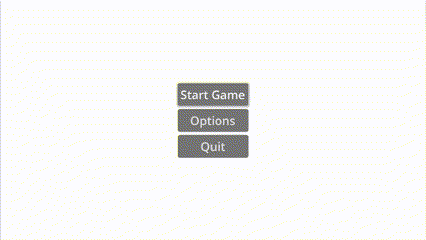

# javsc
```sh
                                     ####    ##     ### ###   ## ##    ## ##   
                                      ##      ##     ##  ##  ##   ##  ##   ##  
                                      ##    ## ##    ##  ##  ####     ##       
                                      ##    ##  ##   ##  ##   #####   ##       
                                  ##  ##    ## ###   ### ##      ###  ##       
                                  ##  ##    ##  ##    ###    ##   ##  ##   ##  
                                   ## #    ###  ##     ##     ## ##    ## ##   
                                             
  ##  ##     ##     ## ##    ## ##    ## ##    ## ##   ##   ##  ##   ##    ####   #### ##   ## ##   ##   ##  
  ##  ##    ###    ##   ##  ##   ##  ##   ##  ##   ##   ## ##    ## ##      ##    # ## ##  ##   ##  ##   ##  
##########   ##    ##   ##  ##   ##  ##       ##   ##  # ### #  # ### #     ##      ##     ##   ##  ##   ##  
  ##  ##     ##    ##   ##  ##   ##  ##       ##   ##  ## # ##  ## # ##     ##      ##     ##   ##  ## # ##  
##########   ##    ##   ##  ##   ##  ##       ##   ##  ##   ##  ##   ##     ##      ##     ##   ##  # ### #  
  ##  ##     ##    ##   ##  ##   ##  ##   ##  ##   ##  ##   ##  ##   ##     ##      ##     ##   ##   ## ##   
  ##  ##    ####    ## ##    ## ##    ## ##    ## ##   ##   ##  ##   ##    ####    ####     ## ##   ##   ## 
```

## Purpose of this repository

**JAVSC** stands for Just Another [Vampire Survivors](https://store.steampowered.com/app/1794680/Vampire_Survivors/) Clone. Main inspiration is [Brotato](https://store.steampowered.com/app/1942280/Brotato/) game.   
In this repository I'm learning creating games in [Godot Engine](https://godotengine.org/) and documenting my path to creating my first game.
Whole process is being recorded and documented as a [daily vlog](https://www.youtube.com/watch?v=tK4yK3d1Flg&list=PLij67yf0bICPZl7FxQ5w4sn3nveCW8yf3) on youtube.  
Additional materials will be documented in [diary folder](./diary/README.md) in this repository.  

## Scope of the project

A game is an activity that's purpose is facing a challenge in environment with forced rules.  
For this project, main rule is to survive untill the end of time for each wave.  
Main way of doing so will be eliminating hordes of enemies. Other way might be running away from enemies.

### Phase 1

Features that I plan to deliver in Phase 1:

Player will be controlling a character, that is running on a plane with set boundaries.  
Keyboard and PS4 Gamepad will be supported input devices.  
Camera will be following the player.  
There will be single type of enemy simply following player, trying to catch it.  
Enemies will be spawning at random locations on map in throughout the time of wave.  
Player will have melee and ranged weapon to choose from. 
Defeating enemies will provide experience, which can be used to train the character.  
Player will have to survive 2 waves in order to win the game.  
Publish built game somewhere (hopefully in GitHub Releases). 

#### Day 31 game status 



### Phase 2

New enemy types will be added.  
New weapons will be added.  
New characters with distinct characteristics will be added.  

### Phase 3

As I learn Godot more, new ideas might come to my head.  
Phase 3 is a place for new ideas.

## How to play

At the moment, only way to run this is by pressing Play from within Godot Engine.  
Player can be controller by keyboard (using arrows) or PS4 gamepad (using left analogue stick).  