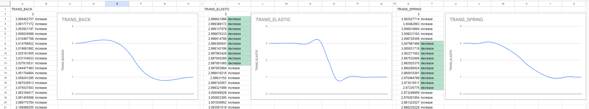

# Dev diary - materials

I will be maintaining notes for each step and planing next steps here.

## Day #0

Topic: Intro and welcome  
[Daily vlog #0](https://www.youtube.com/watch?v=tK4yK3d1Flg&list=PLij67yf0bICPZl7FxQ5w4sn3nveCW8yf3)


## Day #1

> “What you gonna see when you wake up?”  
> Lyrics : Karnivool - Goliath

Topic: Vanila Godot project and GitHub desktop configuration  
[Daily vlog #1](https://www.youtube.com/watch?v=hC9cj0s29Xo&list=PLij67yf0bICPZl7FxQ5w4sn3nveCW8yf3&index=2)


## Day #2

> “Black then white are all I see”  
> Lyrics: Tool - Lateralus

Topic: Defining Main scene Node, Camera and Player Node  
[Daily vlog #2](https://www.youtube.com/watch?v=vnA81df5uDs&list=PLij67yf0bICPZl7FxQ5w4sn3nveCW8yf3&index=3)

- main node and main scene
- set background to white - Project -> project settings -> Rendering.Environment -> default clear color 
- create a png in pain(t)
- add a camera Node
- player Node
    - RigidBody2d - object that is affected by physics, collide, has mass; 
    - sprite to be visible
	- CollisionShape2D (should occupy the same space as the sprite for good UX)


## Day #3

> “Take one step left and one step right  
> One to the front and one to the side”  
> Lyrics: Lou Bega - Mambo no. 5

Topic: Player Movement script  
[Daily vlog #3](https://www.youtube.com/watch?v=Ru_UVCVOv_g&list=PLij67yf0bICPZl7FxQ5w4sn3nveCW8yf3&index=4)

- player - RigidBody2d - object that is affected by physics, collide, has mass
	- `_physics_process(delta)` is the function that is triggered by game loop, movement logic might be there for now; it might be better to extract it to `_process(delta)` later on, if maintaining all Nodes will take more time than `delta`
        - `delta` is time between previous execution
        - `_physics_process` is triggered at regular interval of around 1/60 sec - trying to get 60FPS by default (this can be changed in project settings)
        - `_process` is triggered at irregular interval, so every function that moves Nodes should be multiply by delta, to accomodate for this
        - maximum FPS can be set in projects settings to test how algorythms with and without delta works
        - some built-in functions multiply by delta out-of-the-box (for example: `move_and_slide`)
	- higher mass makes the RigidBody2D to move slower
	- setting Linear.Damp makes the RigidBody2D to lose speed (slow down and eventually stop)
    - GravityScale is used to control wheter player will be pulled downwards


## Day #4

> "I got the mooooooves like jagger"  
> Maroon 5 - Moves Like Jagger

Topic: Abstracting input with Input Map  
[Daily vlog #4](https://www.youtube.com/watch?v=1rPrcSxJ-fE&list=PLij67yf0bICPZl7FxQ5w4sn3nveCW8yf3&index=5)

https://docs.godotengine.org/en/stable/tutorials/2d/2d_movement.html


## Day #5

> “Red and yellow then came to be”  
> Lyrics: Tool - Lateralus

Topic: Enemies as reuseable assets and collisions  
[Daily vlog #5](https://www.youtube.com/watch?v=i57Ks2qwz4Y&list=PLij67yf0bICPZl7FxQ5w4sn3nveCW8yf3&index=6)

- enemy Node
	- RigidBody2D
	- sprite
	- collitionShape2D
- drag enemy Node to FileSystem to create scene
- drag few enemy scenes to 2d pane 
- check Gravity
- fixing GravityScale and Linear.Damp in scene does change it for enemies already added to the main scene unless it has been changed on the instance
- fix enemy scene
- add new enemy
- `lock_rotation` on player to prevent from spinning


## Day #6

> "This shit is not random"  
> Lyrics: G-Eazy - Random

Topic: Script for spawning enemies  
[Daily vlog #6](https://www.youtube.com/watch?v=Q1WwTJUXYjk&list=PLij67yf0bICPZl7FxQ5w4sn3nveCW8yf3&index=7)

Today we will be spawning some enemies

- https://docs.godotengine.org/en/stable/classes/class_randomnumbergenerator.html
- `@export var var_name` makes the variable visible in Inspector and you can specify the value for it there
- `preload` function allows for preloading a scene - `var enemy_scene = preload("res://enemy.tscn)`
- then to instantiate a scene you can use `var enemy = enemy_scene.instantiate()` - this creates the object in memory, we have to add it to the main node `add_child(enemy)`
- `randi_range` - calculates random integer in specified range
- `randf_range` - calculates random float in specified range 
- `enemy.position.x`, `enemy.position.y` - to say where the enemy should be
- `enemy.scale.x`, `enemy.scale.y` - to say how big or small the enemy should be


## Day #7 - starting diary

> Dear Diary, I'm here to stay  
> Lyrics: Ozzy Osbourne - Diary of a Madman

Topic: Improving README.md and moving project notes into git repository
[Daily vlog #7](https://www.youtube.com/watch?v=OhThxiCf8RQ&list=PLij67yf0bICPZl7FxQ5w4sn3nveCW8yf3&index=8) 


## Day #8 - analysing Nordic Ashes

> Earth to earth, ashes to ashes, dust to dust  
> Lyrics: Book of Common Prayer

Topic: Analyze mechanics of Nordic Ashes to get some inspiration
[Daily vlog #8](https://www.youtube.com/watch?v=Y8P21im4TtY&list=PLij67yf0bICPZl7FxQ5w4sn3nveCW8yf3&index=9) 

[Steam - Nordic Ashes: Survivors of Ragnarok](https://store.steampowered.com/app/2068280/Nordic_Ashes_Survivors_of_Ragnarok/)


## Day #9 - camera following player

> Wherever life takes you, you know I'll follow you  
> Lyrics: Imagine Dragons - Follow you

Topic: Make camera follow the player
[Daily vlog #8](https://www.youtube.com/watch?v=_LGFOholVic&list=PLij67yf0bICPZl7FxQ5w4sn3nveCW8yf3&index=10)

- get_node or $ to get player node
- use player node to get it's position and assign it to camera node position


## Day #10 - enemies chasing player

> And just when I think I've worked it out, these pieces move...  
> Lyrics: Karnivool - Umbra

Topic: Enemies chasing player and fixing diagonal movement bug
[Daily vlog #10](https://www.youtube.com/watch?v=tagbxehLgPY&list=PLij67yf0bICPZl7FxQ5w4sn3nveCW8yf3&index=11)

- Godot docs on [vector math](https://docs.godotengine.org/en/stable/tutorials/math/vector_math.html#introduction)
- For further deep-dive into linear math - [Khan Academy](https://www.khanacademy.org/math/linear-algebra)
- pythagoras theorem for movement 
	- moving vector(1,1) will result in moving player longer distance comparing to just moving vector(1,0)
- vector - direction ((x,y) for vector2D, (x,y,z) for vector3D) and magnitude
	- unit vector (or direction vector, or normal) - vector with magnitude of 1
- calculated vector should be normalized (using Vector2D.normalized() function call)
	- normalization is reducing vectors length to 1 while preserving direction
- position.direction_to() is already normalized
- scripts are in [day10-notes](./day10-notes.md)


## Day #11 - planning next improvements

> And there's no time to think
> Lyrics: Bob Dylan: No Time to Think

Topic: Plan next improvements
[Daily vlog #11](https://www.youtube.com/watch?v=bgh81cSj5vQ&list=PLij67yf0bICPZl7FxQ5w4sn3nveCW8yf3&index=12)

## Day #12 - player dies and respawns

> ... and I'm back to the start
> Lyrics: Karnivool - Umbra

Topic: Handle player spawning at starting position
[Daily vlog #12](https://www.youtube.com/watch?v=3JvC4osan00&list=PLij67yf0bICPZl7FxQ5w4sn3nveCW8yf3&index=13)

- Define starting position
- add Group for "enemies"
- add enemies to the group on being spawned
- set RigidBody2D.MaxContacts to more than 0 to make collsion work

```python - EnemiesSpawn.gd
	var enemies = get_tree().get_nodes_in_group("enemies")
	print_debug(str("enemies count", enemies.size()))
```

```python - PlayerMovement.gd
	func _on_body_entered(body):
	if body.is_in_group("enemies"):
		print_debug("dead")
		get_tree().reload_current_scene()
```


## Day #13 - improve enemy spawning

> Life’s a game, but it’s not fair
> Lyrics: Jay-Z - Run This Town

Topic: Make the game more fair
[Daily vlog #13](https://www.youtube.com/watch?v=Uav-TBOZYkE&list=PLij67yf0bICPZl7FxQ5w4sn3nveCW8yf3&index=14)

- spawn enemies few seconds after spawning player
	- `Timer` class to execute action based on elapsed time
	- we will use timer to spawn enemies at random times
	- `preload` function allows for preloading a scene - `var enemy_scene = preload("res://enemy.tscn)`
- modify enemies spawn script to prevent from spawning really closely to player
- change enemies spawn count to 1 to see in which quadrant they are spawned

```python
extends Node2D

@export var enemies_count = 50
var renemy_scene = preload("res://Enemies/Renemy/renemy.tscn")
var yenemy_scene = preload("res://Enemies/Yenemy/yenemy.tscn")

# Called when the node enters the scene tree for the first time.
func _ready():
	pass

# Called every frame. 'delta' is the elapsed time since the previous frame.
func _process(delta):
	pass

func _on_enemy_spawn_timer_timeout():
	var safe_zone_radius = 65
	var player_position = $Player.global_position
	
	print_debug(str(player_position.x, " ", player_position.y))
	
	for i in enemies_count:		
		var enemy_position_x
		var enemy_position_y
		var quadrant = randi_range(0, 3)
		match quadrant:
			0:
				print_debug("quadrant 0")
				enemy_position_x = randi_range(player_position.x - 136, player_position.x - 136 + safe_zone_radius)
				enemy_position_y = randi_range(player_position.y - 73, player_position.y - 73 + safe_zone_radius)
			1:
				print_debug("quadrant 1")
				enemy_position_x = randi_range(player_position.x + 136, player_position.x + 136 - safe_zone_radius)
				enemy_position_y = randi_range(player_position.y - 73, player_position.y - 73 + safe_zone_radius)
			2:
				print_debug("quadrant 2")
				enemy_position_x = randi_range(player_position.x + 136, player_position.x + 136 - safe_zone_radius)
				enemy_position_y = randi_range(player_position.y + 73, player_position.y + 73 - safe_zone_radius)
			3:
				print_debug("quadrant 3")
				enemy_position_x = randi_range(player_position.x - 136, player_position.x - 136 + safe_zone_radius)
				enemy_position_y = randi_range(player_position.y + 73, player_position.y + 73 - safe_zone_radius)

		var enemy_type = randi_range(0, 1)

		var enemy
		if enemy_type == 1:
			enemy = renemy_scene.instantiate()
		else:
			enemy = yenemy_scene.instantiate()

		enemy.position.x = enemy_position_x
		enemy.position.y = enemy_position_y
		add_child(enemy)

```

## Day #14 - animation for enemy spawning

> Compensate me, animate me
> Lyrics: Rush - Animate

Topic: Add animation for enemies
[Daily vlog #14](https://www.youtube.com/watch?v=VNosEfK6oEQ&list=PLij67yf0bICPZl7FxQ5w4sn3nveCW8yf3&index=15)

- enemy should not appear right away, there should be an indicator that an enemy will spawn at given position
- add Sprite2d for spawn for renemy
- add spawn Timer for renemy
- ctrl + drag into script = create @onready variable
- modify script to implement spawning indicator and setting default values for enemy
- show and hide spawn sprite in enemy script
- run and fail - changes must be done to yenemy, because script is reused - we have to rethink scripting strategy 
- Sprite2D.CanvasItem.Filter = nearest to sharpen the image (remove blur)
- Project -> Project Settings -> Rendering -> Textures -> Canvas Textures: Default Texture Filter - set to Nearest for pixel art game

```phyton - NormalizedDiagonalMove.gd
extends RigidBody2D

@onready var player_node = $"/root/Main/Player"
@export var speed = 10
@onready var sprite_2d = $Sprite2D
@onready var collision_shape_2d = $CollisionShape2D
@onready var spawn_sprite = $SpawnSprite
@onready var spawn_timer = $SpawnTimer

var timer_ticks_count_until_spawn = 10

func _ready():
	collision_shape_2d.disabled = true
	sprite_2d.hide()
	self.freeze = true
	spawn_timer.start()
	spawn_sprite.show()

func _physics_process(delta):
	var direction_vector = position.direction_to(player_node.position)
	linear_velocity = direction_vector * speed

func _on_spawn_timer_timeout():
	if(timer_ticks_count_until_spawn > 0):
		timer_ticks_count_until_spawn -= 1
		spawn_sprite.visible = !spawn_sprite.visible 
	else:
		spawn_timer.stop()
		spawn_sprite.hide()
		self.freeze = false
		sprite_2d.show()
		collision_shape_2d.disabled = false
```

## Day #15 - pause the game

> Just Stop
> Lyrics: Disturbed - Just Stop

Topic: Add the pause feature
[Daily vlog #15](https://www.youtube.com/watch?v=efrZamATvHE&list=PLij67yf0bICPZl7FxQ5w4sn3nveCW8yf3&index=16)

- add new Input Mapping `pause_menu` for escape and options on PS4 pad
- add pause label
- add script to Main node with stopping the game
	- Input.is_action_just_pressed("pause_menu")
	- set Inspector.Process:Mode to `Always`
	- get_tree().paused = true to stop Main node and all children
	- this does not stop Timers
- set Timer Node's Inspector.Process:Mode to `Pausable` to make it stop ticking
- other solution is stoping the time in game engine
	- Engine.time_scale = 0.0


## Day #16 - add rule allowing the player to win the game

> While I'm still alive
> Lyrics: Karnivool - Deadman

Topic: Add rule that allows player to win the game
[Daily vlog #16](https://www.youtube.com/watch?v=wulK59uQ47Y&list=PLij67yf0bICPZl7FxQ5w4sn3nveCW8yf3&index=17)

- add label for Won the game banner
- add lable for diapling time left
- add time left Timer Node
- attach time_left_time.time_left to time_left_label.text
	- format time_left to MM:ss (12:34 - 12 minutes, 34 seconds) - `var formatted_time_left = "%02d:%02d" % [minutes, seconds]`
- remove enemies when time elapsed

## Day #17 - use Tweeners to animate start game countdown - 3, 2, 1 - survive!

> It's the final countdown
> Lyrics: Europe - The Final Countdown

Topic: Countdown to start game animated with Tweeners
[Daily vlog #17](https://youtube.com/watch?v=q2lgQ4KZAM8&list=PLij67yf0bICPZl7FxQ5w4sn3nveCW8yf3&index=18)

- Tweener is used to change property of node/resource using bezier curves
- [Godot docs - Tween](https://docs.godotengine.org/en/stable/classes/class_tween.html#class-tween)
- [Godot Tweening Cheatsheet](https://raw.githubusercontent.com/godotengine/godot-docs/master/img/tween_cheatsheet.webp)


## Day #18 - Main Menu Scene

> Just begin
> Lyrics: A Perfect Circle - Eat The Elephant

Topic: Main Menu scene
[Daily vlog #18](https://www.youtube.com/watch?v=V8ExxHYbKSk&list=PLij67yf0bICPZl7FxQ5w4sn3nveCW8yf3&index=19)

- add new scene of type User Interface
- quit option (https://docs.godotengine.org/en/stable/tutorials/inputs/handling_quit_requests.html#sending-your-own-quit-notification)
	- `get_tree().quit` will force close the game
	- use `get_tree().root.propagate_notification(NOTIFICATION_WM_CLOSE_REQUEST)` to allow for handling saving, confirmation popup etc
- start game button should load game scene 
	- use `get_tree().change_scene("res://scene.tscn")` to change scene to another
- adding new scene as a child of current scene (for Options screen in future)
	- `get_tree().current_scene.add_child(scene_instance)`
- control Main Menu by keyboard is already built-in when first button is defined
	- in Menu scene, in _ready function, reference the start button and call `grab_focus()` method on it - `$StartButton.grab_focus()`
- button -> inspector -> focus : Neighbours - set this to control which control should be focused next after pressing any of buttons that are available to be mapped
- Project Settings -> Input Map -> Show built-in action, assign PS gamepad X button to `ui_accept` action

### Day #19 Animating Enemies using AnimatedSprite Node

> Woh oh oh oh oh oh, yeah yeah
> Lyrics: Greta Van Fleet - Black Smoke Rising

Topic: Using AnimatedSprite2D to create animations for enemies
[Daily vlog #19](https://www.youtube.com/watch?v=7Zy9Wd6Plac&list=PLij67yf0bICPZl7FxQ5w4sn3nveCW8yf3&index=20)

https://docs.godotengine.org/en/stable/tutorials/2d/2d_sprite_animation.html
https://www.youtube.com/watch?v=yZufjzzKtTA
- create a spritesheet or multiple sprites for animating
- Project -> Project Settings -> Rendering -> Textures -> Canvas Textures: Default Texture Filter - set to Nearest
- Project -> Project Settings -> Display -> Window -> Size: Viewport Height and Width to accomodate for smaller pixel arts
- Project -> Project Settings -> Display -> Window -> Stretch: Mode to canvas_items, to scale up everything that we have when we make the window bigger
- Project -> Project Settings -> turn on Advanced Settings -> Display -> Window -> Size: set default window size to have the window stretched after starting debugging (1280 x 720)
- Debug -> Visible Collision Shapes
- SpriteFrames resource must be attached to AnimatedSprite node

### Day #20 Review Godot best practices

> Be humble
> Lyrics: Kendrick Lamar - HUMBLE.

Topic: Review Godot best practices and note down what to fix in current game.
[Daily vlog #20](https://www.youtube.com/watch?v=6HRtbNb_SnQ&list=PLij67yf0bICPZl7FxQ5w4sn3nveCW8yf3&index=21)

https://docs.godotengine.org/en/stable/tutorials/best_practices/index.html

- scenes are extension to a script. You could do everything from within scripts, without any scenes, but it is convinient to have them
- Child nodes should not depend of any information to be available except what they contain internally
- Parent nodes can act as mediator between children and coordinate their work (e.g. by calling child's methods, passing other children as parameters)
- Singletons (Autoloads) can be used to store data that is needed for every scene (like player score, settings etc)
	- for smaller projects, overriding the scene with another one while preserving the Main node could be enough; data would then be still available on the Main node
- common structure for games if to have a Main node with World Node and GUI Node as children

### Day #21 More learning

> when I learn to fly high
> Lyrics: Foo Fighters - Learn to Fly

Topic: Learn some more about Godot
[Daily vlog #21](https://www.youtube.com/watch?v=yvDmgI2oiCI&list=PLij67yf0bICPZl7FxQ5w4sn3nveCW8yf3&index=22)

- [Every 2D node explained in 9 Minutes!](https://www.youtube.com/watch?v=22VYNOtrcgM)
- [Every UI Node Explained in 12 Minutes](https://www.youtube.com/watch?v=sPfoZy-cW-E)

#### Action points

- check out Camera2D settings (Drag and smoothing) to fix jagged/laggy looks when player moves
- main node should be the orchestrator of the game
- each component should be self-contained, providing a way of setting it's dependencies through methods by an orchestator, and not accessing siblings in Scene Tree directly 
	- enemies should not reference Player directly to get it's position
	- enemies should have `target` property, and this should be set by coordinating node; then in script, enemies can use `target.global_position` to get position of the target and move towards it

### Day #22 Decouple Enemies and Player

> fix me, please
> Lyrics: Rise Against - Fix Me

Topic: Fix the scripts
[Daily vlog #22](https://www.youtube.com/watch?v=vwaVWSXgQVQ&list=PLij67yf0bICPZl7FxQ5w4sn3nveCW8yf3&index=23)

- decouple enemies from player
- fix script names, to match nodes they are attached to


### Day #23 Decouple Camera and Player

> piece by piece.
> Lyrics: Strata - Piece by Piece

Topic: Fix the scripts pt. 2
[Daily vlog #23](https://www.youtube.com/watch?v=BE2x4LJFt3o&list=PLij67yf0bICPZl7FxQ5w4sn3nveCW8yf3&index=24)

- decouple camera from player
- fix script names, to match nodes they are attached to

### Day #24 Move nodes inside viewport

> I'd like to change my point of view.
> Lyrics: Fools Garden - Lemon Tree

Topic: Move nodes inside the viewport to lay ground for HUD rework
[Daily vlog #24](https://www.youtube.com/watch?v=E5XNlwRbo3Q&list=PLij67yf0bICPZl7FxQ5w4sn3nveCW8yf3&index=25)

https://docs.godotengine.org/en/stable/getting_started/first_2d_game/index.html

- in 2D pane, select enemy scenes, select Main node and press Group Selected Node - this prevents child nodes from being selectable and draging them outside of parent's position
- The CanvasLayer node lets us draw our UI elements on a layer above the rest of the game, so that the information it displays isn't covered up by any game elements like the player or mobs.
	- It is rendered in the viewport, so it is good to align the camera and player so that they inside the viewport as well

https://docs.godotengine.org/en/stable/about/introduction.html

- add info about licences

### Day #25 HUD rework

Topic: Decouple the HUD from Main Node by defining API and signals for HUD
[Daily vlog #25 - last one](https://www.youtube.com/watch?v=qz2srAWJXIw&list=PLij67yf0bICPZl7FxQ5w4sn3nveCW8yf3&index=26)

- "HUD" stands for "heads-up display"
- `await get_tree().create_timer(1.0).timeout` - this line stops script's execution for 1 second, can be useful for handling HUD animations without additional Timer nodes
	- countdown script has to be fixed to accomodate for pausing the game
- `queue_free()` to enqueue object to be removed from scene_tree and memory. If object should stay in memory, `remove_child()` might be used to just remove Node from scene_tree
	- `get_tree().call_group("enemies", "queue_free")` - to execute "queue_free" method on each node in "enemies" group

### Day #26 Fix pausing the game

- creating Timer with second parameter as `false` makes the Timer respect SceneTree pause
	- `get_tree().create_timer(1.0, false).timeout`
- creating Tween with setting Pause Mode to TWEEN_PAUSE_STOP makes the Tween respect SceneTree pause
	- `create_tween().set_pause_mode(Tween.TWEEN_PAUSE_STOP)`

### Day #27 Fix label overriding when pausing the game

- add new label that is used only for showing Game Paused message

### Day #28 Improve enemies spawning script
- use `get_viewport_rect().size` to calculate position for spawning enemies

### Day #29 Recycle enemies

- if player runs too far from an enemy, destroy it and spawn new one
- always maintain the same count of enemies

### Day #30 Applying code style

- https://docs.godotengine.org/en/stable/tutorials/scripting/gdscript/gdscript_styleguide.html
- Text Editor > Completion > Add Type Hints to get more hints about autocompletion that enhances intelisense

### Day #31 Add dashing (through the snow)

- https://raw.githubusercontent.com/godotengine/godot-docs/master/img/tween_cheatsheet.webp
- dash should briefly increase players movement, resulting in exhaustion at the end and slowing down player a little bit below normal speed
- Tweens will be used to modifying Player's speed multiplier 
- testing Transitions - `Back`, `Elastic` and `Spring` looks like good candidate for dashing

- `Back` has been selected for dash

### Day #32 Brainstorming at the midnight
- came up with few ideas for mechanics and setting

### Day #33 Options menu
- [Every UI Node Explained in 12 Minutes](https://www.youtube.com/watch?v=sPfoZy-cW-E)
- new scene which will be used to control Options

### Day #34 In-game Pause menu with option to quit, restart, go to settings
- modified HUD scene to contain few buttons for in-game pause menu

### Day #35 Credits scene
- added scene for listing Open Source projects used - to be enhanced with 
https://docs.godotengine.org/en/stable/about/complying_with_licenses.html#inclusion

### Day #36 Learning 
- https://docs.godotengine.org/en/stable/about/faq.html#how-should-assets-be-created-to-handle-multiple-resolutions-and-aspect-ratios
- https://godotengine.org/article/why-isnt-godot-ecs-based-game-engine/
	- Entity component system - An ECS comprises entities composed from components of data, with systems which operate on the components; attaching components to entities (which usually are just an Id, as in Unity), which are then processed by systems; 
		- is good for heavy data-oriented cases, with tens of thousands objects being processed at once (not the case for smaller games)
		- https://en.wikipedia.org/wiki/Entity_component_system
		- https://en.wikipedia.org/wiki/Data-oriented_design
		- https://pl.wikipedia.org/wiki/GPGPU
	- Godot focuses on inheritance and having Data and Logic in the same object (Node), but still can work out with heavy data-oriented games
		- Servers and RIDs - for further reading

### Day #37 more learning

### Day #38 Even more learning

### Day #39 More Even more learning

### Day #40 Minor refactorings
- to have Static Typing style, you should enable settings "Text Editor > Completion > Add Type Hints"
- also add some warnings in future : https://docs.godotengine.org/en/stable/tutorials/scripting/gdscript/static_typing.html#warning-system

### Day #41 Analyze what's left and learning

### Day #42 Learning 
https://docs.godotengine.org/en/stable/getting_started/introduction/index.html

### Day #43 Learning continues
https://docs.godotengine.org/en/stable/getting_started/introduction/index.html

### Day #44 Learning continues
https://docs.godotengine.org/en/stable/getting_started/introduction/index.html

- nodes are the basic building blocks
- scenes are created by nodes

### Day #45 Learning continues
https://docs.godotengine.org/en/stable/tutorials/editor/index.html
https://docs.godotengine.org/en/stable/tutorials/export/feature_tags.html
https://docs.godotengine.org/en/stable/community/asset_library/index.html

### Day #46 Learning continues

---

## Future

### Day # - script styling
https://docs.godotengine.org/en/stable/tutorials/scripting/gdscript/gdscript_styleguide.html
- grouping @export variables into `@export_group` and `@export_category`  
- value managers (e.g. `@export_range`)
- Godot naming conventions for GDScript - Classes (nodes) use PascalCase, variables and functions use snake_case, and constants use ALL_CAPS (See GDScript style guide)

### Day # set up code cleanup/styling tooling
### Day # Enable warnings to improve Static Typing
- https://docs.godotengine.org/en/stable/tutorials/scripting/gdscript/static_typing.html#warning-system

### Day # Add upgrade graphics
- https://github.com/Orama-Interactive/Pixelorama
- https://github.com/RodZill4/material-maker

### Day # Add Options to In-game Pause menu
- add as a child of current scene

### Day # Options - multiple resolutions
- https://docs.godotengine.org/en/stable/tutorials/rendering/multiple_resolutions.html#doc-multiple-resolutions
- https://docs.godotengine.org/en/stable/about/faq.html#how-should-assets-be-created-to-handle-multiple-resolutions-and-aspect-ratios

### Day #2y - apply suggestions from Godot best practices (Day #20 - #23)

### Day # Fix HUD scaling and labels overriding eachother
- https://docs.godotengine.org/en/stable/tutorials/ui/size_and_anchors.html#doc-size-and-anchors
- scaling labels in HUD messes up the centering (showing message with scaling set to more than Vector2(1.0, 1.0))
	- scaling labels is shitty, because anchor of labels are top left corner
	- put label inside Node2D and animate the parent (https://www.reddit.com/r/godot/comments/134yg1j/godot4_centering_scaled_label_outside_container/)
	- Label.pivot_offset could work

### Day # Limit the place to run
- `position.clamp(Vector2.ZERO, screen_size)` to limit range in which player may walk

### Day # - even more learning!

Go through godot docs
- https://docs.godotengine.org/en/stable/tutorials/best_practices/index.html
- https://docs.godotengine.org/en/stable/tutorials/scripting/index.html#core-features
- https://docs.godotengine.org/en/stable/tutorials/scripting/gdscript/index.html
- https://docs.godotengine.org/en/stable/tutorials/2d/index.html
- https://docs.godotengine.org/en/stable/tutorials/physics/index.html
- https://docs.godotengine.org/en/stable/tutorials/inputs/index.html
- https://docs.godotengine.org/en/stable/tutorials/io/saving_games.html
- https://docs.godotengine.org/en/stable/tutorials/animation/index.html
- https://docs.godotengine.org/en/stable/tutorials/audio/index.html
- https://docs.godotengine.org/en/stable/tutorials/i18n/index.html
- https://docs.godotengine.org/en/stable/tutorials/export/index.html
- Servers and RIDs
	- https://godotengine.org/article/why-does-godot-use-servers-and-rids/


### Day # - multiple game difficulties
- passing parameters when loading a scene
	- easy - survive 10 seconds
	- medium - survive 30 seconds
	- hard - survive 60 seconds

### Day # Animating Player using Sprite2D with child node AnimationPlayer 

https://docs.godotengine.org/en/stable/tutorials/2d/2d_sprite_animation.html#sprite-sheet-with-animationplayer
https://www.youtube.com/watch?v=sVJEaYNOUNw
https://www.youtube.com/watch?v=Vwj_hX9h4zo
- create a spritesheet for animating
- Project -> Project Settings -> Rendering -> Textures -> Canvas Textures: Default Texture Filter - set to Nearest
- Project -> Project Settings -> Display -> Window -> Size: Viewport Height and Width to accomodate for smaller pixel arts
- Project -> Project Settings -> Display -> Window -> Stretch: Mode to canvas_items, to scale up everything that we have when we make the window bigger
- Project -> Project Settings -> turn on Advanced Settings -> Display -> Window -> Size: set default window size to have the window stretched after starting debugging (1280 x 720)
- Debug -> Visible Collision Shapes

- Sprite2d -> Inspector -> Animation: HFrames - number of columns with sprites in the sprite sheet; VFrames - number of rows with sprites in the sprite sheet
- gives more power than AnimatedSprite in scripting
- select idle animation as the one that is selected at the start, so select "Autoplay on Load"
- for Sprite2D node, press key sign that is next to properties in Inspectorfor settings that should be unique for given animation, so they do no affect other animations in the same AnimationPlayer
- select looping to get animation loop
- be sure that animations have the same number of frames, because setting animation speed affects all animations
- calling defined animation from script to play animation when moving and idle
- in script, Sprite2d.flip_h and flip_v can be used to flip that sprite animation according to selected axis
- 

### Day # Adding Node state machine to Player animation

- AnimatedSprite2D + AnimationPlayer + AnimationTree => https://www.youtube.com/watch?v=1DwT5Xe8n6Y

### Day # - more working on movement 

 `delta` parameter and `linear_velocity` 
- godot docs - `RigidBody2D.linear_velocity` is bad way to move player, they suggest to use `_integrate_forces` - to check in future 

- limit fps -> Project -> Project Settings -> advanced settings -> search for FPS -> set to 10 frames per second => 1 frame each 0.1 second
- `_physics_process` vs `_process`
	- process - runs as often as possible
	- physics_process - This separate process is run at a capped framerate which is set in the projects physics settings (Physics → Common → Physics Ticks per Second), at 60 FPS by default. However, there are some important caveats to this. For one, the execution is not guaranteed to be at a constant rate - if too many operations take place in a single physics step it will slow down

### Day # - attacking enemies

### Day # player mechanics - Bullet-Time

### Day # counting points for near missing enemies

### Day # - adding audio

### Day # - Path finding
- add obstacles (StaticBody2D) to see how enemies try to get to player
- using Joint2D to connect StaticBodies and create moving parts of map

### Day # - Improved Path finding
- look into using Navigation Region/Link/Obstacle 2D

### Day # - using TileMap editor

### Day # - CanvasModulate and Light2D nodes

### Day # - collectables / achievements

### Day # - handling player Profiles (separate collectables and achievements)

### Day # - Project settings before publishing

- Set Application Icon - Project Settings -> Application -> Config: Set Icon
- Set Application Icon - Project Settings -> Application -> Config: Set Name + Localized name
- Set Splashscreen - Project Settings -> Application -> Boot Splash
- Set Main Scene - Project Settings -> Application -> Run: Main Scene
- Set game to Fullscreen mode if it is meant to be a fullscreen game - Project Settings -> Display -> Window: Mode - Fullscreen
- Set Mouse Cursor - Project Settings -> Display -> Mouse Cursor
- Smooth the edge (Anti Aliasing) - Project Settings -> Rendering -> Anti Aliasing

### Day # - github actions that build project

### Day # - attach exe as Github Release

### Day # - Guard enemies
- enemies set out to "partol" a path (using Follow/Path2D)
- when they spot Player (using Raycast2D/ShapeCast2D), they enter the chase mode

### Day # shadders

- BackBufferCopy node

### Day # update Credits scene to show licences

https://docs.godotengine.org/en/stable/about/complying_with_licenses.html#inclusion


## setting

- dash
- bullet time
- get points for running close to enemies
- get power from The Void
- set traps
	- player has to draw "trap" by leaving a trail
	- trap is completed when player reaches the begining of the trail
	- all enemies captured inside the trap are trapped and consumed by The Void
	- [to consider] - enemies move faster on the trail until it is closed as a trap
	- player dies when it enters the trap
	- trap stays until end of round
	- after trap is closed, new enemies avoid the trap 
		- [to consider] - can enemies be pushed by other enemies into closed trap?
		- alternative - after trap is closed, it is treated as a hole in map (The Void); player is essentially cutting out the map
	- player should decide to turn trail on and off
	- to leave the trail, player must use ink; 
		- ink can be obtained by sacrificing enemies to The Void (catching them into trap)
		- player earns some ink after completing each wave
			- wave ends with the void flooding whole screen (only white triangle from player's sprite remains visible)
- alternative mechanics : push enemies from or lure them to The Edge
